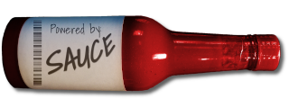
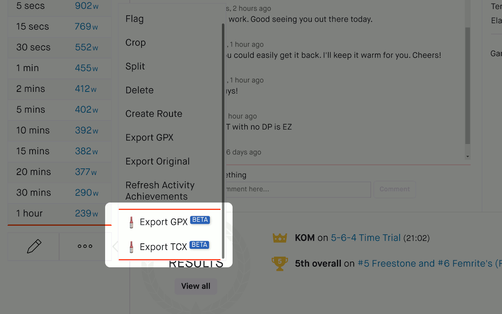

Sauce for Strava™
===========

#### A browser extension for Strava.com
Sauce for Strava™ is a browser extension that upgrades strava.com with more stats,
features and layouts (e.g. dark-mode).

It's free, lightweight and easy to use.

There are no 3rd party services used and it's completely open source.

Installation
--------
#### Official versions:

Feature Highlights
--------
 * Peak performance table:
   * Power
   * Normalized Power
   * Heart Rate
   * Pace
   * Grade Adjusted Pace
   * VAM (climbing speed)
   * Cadence
 * Dark Mode *BETA OPTION*
 * Export any activity to a TCX or GPX file
 * Running Power estimation
 * Analysis page stats are extended to include:
   * Elapsed power average, normalized power, moving power average and watts/kg.
   * Grade adjusted pace
   * TSS
   * Intensity Factory
   * VAM
   * Elevation gain/loss
   * Raw data and graph views
 * Weight and FTP overrides for all athletes
 * Inline comments system for activity page
 * Dashboard features:
   * Chronological ordering *OPTION*
   * Hide virtual activities (except your own) *OPTION*
   * Hide promotions and challenges *OPTION*
 * Responsive layout (mobile support for Firefox) *OPTION*
 * Detailed Running segments *OPTION*

#### Development:
 1. Clone this repo to your local computer.
 2. Run `make`
 3. Go to chrome://extensions/ on your Chrome browser.
 4. Make sure "Developer mode" is checked.
 5. Click "Load unpacked extension..."
 6. Navigate to the directory  where you cloned or unzipped sauce and click "Open."

Release Notes
--------
#### v5.3.0:
 * Dark mode (BETA)

#### v5.2.1:
 * Disable Polish translations until they can be improved
 * Switch from "sync" storage to "local" storage (has more space)

#### v5.2.0:
 * Added French, Italian, Polish and German translations
 * Analysis page menu navigation history *OPTION*

#### v5.1.0:
 * Responsive layout
 * Mobile support (Firefox only)
 * Additional Peak information tables:
   * Cadence
   * Pace for cycling
   * Power for running
 * Swim activity support
 * Other activity support (XC ski, Alpine ski, etc)
 * Bug fixes a plenty
 * Detailed Run segments (using segment support of rides but for runs)

#### v5.0.0:
 * Multi category peak effort chart:
   * Power, NP, VAM, HR, Pace, GAP
 * Settable peak effort ranges: time periods and distances (Advanced Options)
 * Upgraded algo for power data
 * Upgraded analysis view that works in all locales:
   * Kilojoule field
   * Moving vs elapsed time stats
   * Improved placement on page
 * Running power (watts) estimate **[BETA]**
 * Raw data views; CSV table and graphs
 * Kilojoules in analysis view
 * Updated algo for VAM calculations (smoothing)
 * Rank badges for analysis selections
 * Support for HiDPI graphs

#### v4.3.0:
 * TCX and GPX export **[BETA]**

#### v4.1.0:
 * Support for VAM **[BETA]**

#### v4.0.0:
 * Peak power calculations now support irregular recording intervals (non 1 sample / second)
 * Fixes to running pace calculations
 * Add elevation stats to peak power and best pace dialogs
 * Add cadence stat to peak power and best pace dialogs
 * Support auto closing dialogs when clicking away from them
 * Much needed code cleanup
 * Add name information to Advanced menu's FTP overrides table

#### v3.2.0:
 * Show average pace in running "Best Pace" chart instead of elapsed time
 * Use kilometer based pace for metric loving athletes

#### v3.0.0:
 * Activity Feed Filtering (click the sauce bottle to change):
   * Show/hide virtual runs and rides (e.g. Zwift)
   * Show/hide promotions
   * Show/hide challenges
 * World Ranking badges for segments

#### v2.0.0:
 * Running support

#### v1.2.0:
 * Fixes for several loading glitches
 * Smoother FTP override handling;  Added clearing support
 * Fix for ranking badges when gender is unspecified
 * Style and tooltip additions to better explain peak power

#### v1.1.0:
 * Fix analysis view's inline comments to accommodate site changes
 * Minor style tweak for analysis view

#### v1.0.0:
 * Fix for updated strava comment data structure
 * Improved device compatibility of peak power analysis

#### v0.1.0:
 * Heartrate stats in Peak Power table
 * Promise of reasonable stability

#### v0.0.7:
 * Normalized power for selections in Analysis tab

#### v0.0.6:
 * Inline comments

Disclaimer
--------
I don't work for Strava nor have I interacted with any persons from Strava in
the writing of this extension.  All the information used in this extension is
readily available within the Strava.com website.

Legal
--------
Because lawyers and Google:
[Privacy Policy](https://SauceLLC.github.io/sauce4strava/pages/privacy.html)
